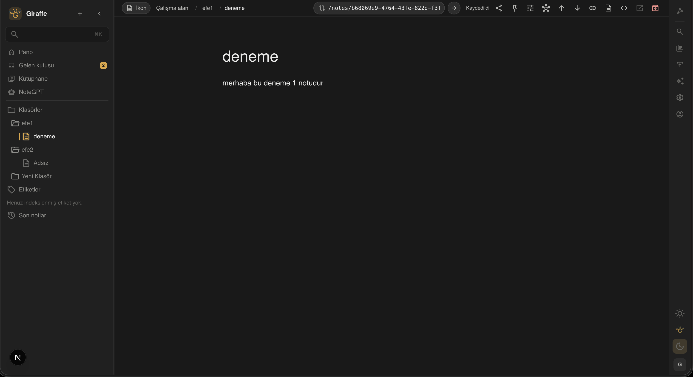
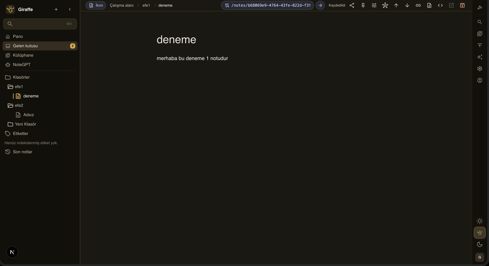

<p align="center">
  
</p>

<h1 align="center">Giraffle</h1>

<p align="center">
  A private, offline-first knowledge workspace. Runs locally on your machine, natively on your phone, and syncs only ciphertext through a server you own.
</p>

<p align="center">
  
  
  
  
  
  
</p>

<p align="center">
  <a href="#why-giraffle">Why Giraffle</a> •
  <a href="#screenshots">Screenshots</a> •
  <a href="#features">Features</a> •
  <a href="#local-development">Local Development</a> •
  <a href="#mobile-app">Mobile App</a> •
  <a href="#self-hosting">Self-Hosting</a> •
  <a href="#project-structure">Project Structure</a>
</p>

## Screenshots

<p align="center">
  
  
  
</p>

## Why Giraffle

Giraffle is for people who want a Notion-like editor, Obsidian-style linking, and full ownership of their data.

Three rules shape every decision:

- **Offline first.** The client owns the data. Every read and write works with no network. Sync is an optional background detail, never a prerequisite.
- **The server is blind.** Content is encrypted on the device. The sync endpoints move ciphertext only — a server operator, including you, cannot read notes.
- **You host it, or nobody does.** No account on someone else's cloud, no telemetry, no built-in AI runtime phoning home.

## Features

- Block-based editing with Tiptap: callouts, toggles, tables, images, code, task lists, slash commands
- Wikilinks, resolved links, and backlinks
- Nested pages — any page can contain other pages, no separate folder concept
- Trek kanban boards, where a board is itself a page (boards can nest into a 2D board-of-boards)
- Stride day planning and Tower Matrix prioritization over the same task records
- Savanna canvas built on Excalidraw, with note references
- Workspace search, archive, tags, and Markdown/MDX export
- End-to-end encrypted vault with per-device keys and ciphertext-only sync
- Native iOS and Android client with its own encrypted local database
- Authenticated MCP endpoint so external agents can drive the workspace
- Self-hosted deployment with Docker Compose, PostgreSQL, and optional nginx

## Architecture

| Piece | What it does |
| --- | --- |
| Web app | Next.js App Router, local-first, works offline |
| Mobile app | Expo / React Native, encrypted SQLite, offline by default |
| Sync server | Ciphertext-only vault endpoints under `/api/v1/vaults` |
| Storage | PostgreSQL 16 via Prisma 7 + `@prisma/adapter-pg` |
| Crypto | libsodium, device-held keys, HLC-ordered operations |
| Auth | NextAuth with credential login |

### Domains

`note` · `link` · `kanban` · `savanna` · `search` · `sync` · `e2ee` · `app-settings` · `mcp` · `update`

### Routes

- `/notes/[noteId]` — editable page view
- `/notes` — all active pages
- `/kanban` — Trek boards
- `/stride` — day planning
- `/tower-matrix` — task prioritization
- `/savanna` — canvas
- `/search` — filterable workspace search
- `/archive` — archived pages
- `/settings` — theme, sidebar, sync, and vault preferences
- `/account` — account and password maintenance

## Local Development

### Prerequisites

- Node.js 20+
- Docker

### Setup

```bash
npm install
docker compose up -d
cp .env.example .env
npx prisma migrate dev
npm run dev
```

Set `AUTH_SECRET` in `.env` to a long random value before logging in.

App runs at `http://localhost:3000`, PostgreSQL at `localhost:5432`.

### Verification

```bash
npm run verify        # prisma validate + lint + typecheck + tests + build
npm run test:run
npm run test:coverage
```

Production-like smoke test — builds the image, starts PostgreSQL, applies migrations, checks `/api/health/ready`:

```bash
ENV_FILE=.env.production npm run smoke:prod
```

## Mobile App

The native client lives in `apps/mobile` (Expo + React Native). It keeps its own encrypted local database and talks to the same ciphertext-only sync endpoints as the web app.

```bash
cd apps/mobile
npm install
npm run ios          # or: npm run android
npm run typecheck && npm run test
```

The canvas surface is bundled as a prebuilt web asset — rebuild it with `tools/excalidraw-mobile/build.mjs` after changing canvas behavior.

## Self-Hosting

Giraffle ships a production Docker Compose stack:

- `postgres` for durable storage
- `app` for the standalone Next.js server
- optional `nginx` through a separate proxy compose file

### Quick start

```bash
git clone <your-repo-url> giraffle
cd giraffle
cp .env.production.example .env.production
$EDITOR .env.production
./scripts/prod-up.sh
```

Then open `http://localhost:3000`, or point your domain at the server and set `NEXTAUTH_URL` to the public URL you actually use.

For image-first control planes such as Coolify, Dokploy, CasaOS, and Portainer, use `deploy/selfhost/docker-compose.image.yml` and set `APP_IMAGE` to a published image, for example `docker.io/efekurucay/giraffle:latest`. You do not need to build the image yourself.

### Required environment variables

- `APP_IMAGE`
- `DATABASE_URL`
- `AUTH_SECRET`
- `NEXTAUTH_URL`
- `LOG_LEVEL`
- `APP_PORT`
- `POSTGRES_USER`
- `POSTGRES_PASSWORD`
- `POSTGRES_DB`
- optional: `APP_ENCRYPTION_KEY` to encrypt app-managed settings stored from the UI
- optional: `DEPLOYMENT_ID` for version-skew protection during rolling deploys
- optional: `APP_UPDATE_REPOSITORY` to point update checks at your own fork's release feed

### What the stack does

- pulls the app image via `APP_IMAGE`
- runs `prisma migrate deploy` on startup
- publishes the app on `APP_PORT` (default `3000`)
- exposes `/api/health/live` and `/api/health/ready`
- persists PostgreSQL data in `giraffle_pgdata` and uploads in `giraffle_uploads`
- keeps `prisma.config.ts` inside the image, since Prisma 7 reads datasource config from it during `migrate deploy`

### Useful commands

```bash
./scripts/prod-logs.sh
./scripts/prod-up-proxy.sh    # adds nginx on port 80 in front of the app
docker compose --env-file .env.production -f docker-compose.prod.yml ps
docker compose --env-file .env.production -f docker-compose.prod.yml restart app
docker compose --env-file .env.production -f docker-compose.prod.yml down
```

### Upgrading

```bash
cd giraffle
git pull
./scripts/prod-up.sh
```

## Security Baseline

- credential login with bcrypt password hashes
- production secret requirement and secure cookies in production
- login and registration rate limiting
- note content encrypted client-side; sync endpoints accept and return ciphertext only
- device keys never leave the device

## Releasing

`package.json` version must match the git tag, always in `vMAJOR.MINOR.PATCH` form.

```bash
npm run verify
git push origin main
git tag v0.11.0
git push origin v0.11.0
```

## Project Structure

```text
src/
  app/            routes, api, layouts
  components/     editor, notes, sidebar, canvas
  domain/         note, link, kanban, savanna, search, sync, e2ee, mcp
  infrastructure/ e2ee primitives
  mcp/            MCP server surface
  server/         server-only wiring
apps/
  mobile/         Expo / React Native client
deploy/           nginx config, image-first compose
scripts/          production stack helpers
tools/            build helpers for bundled web assets
```
