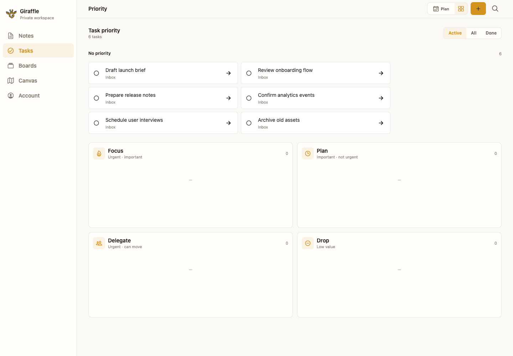
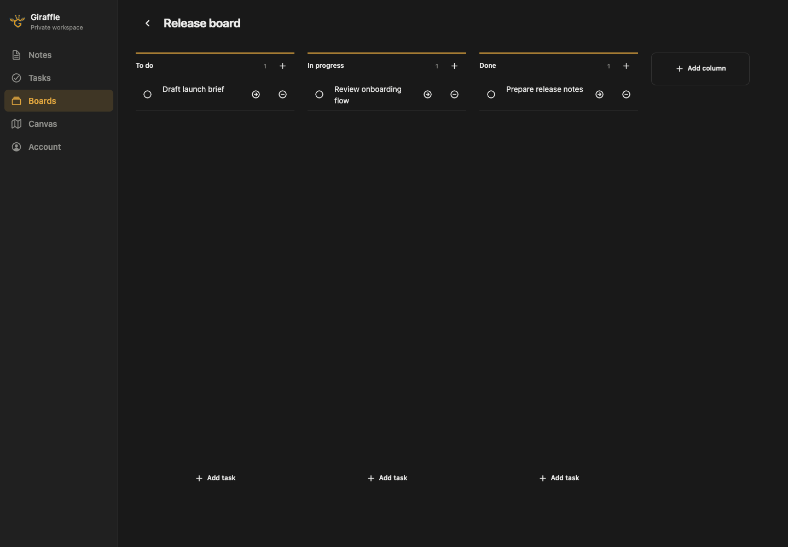
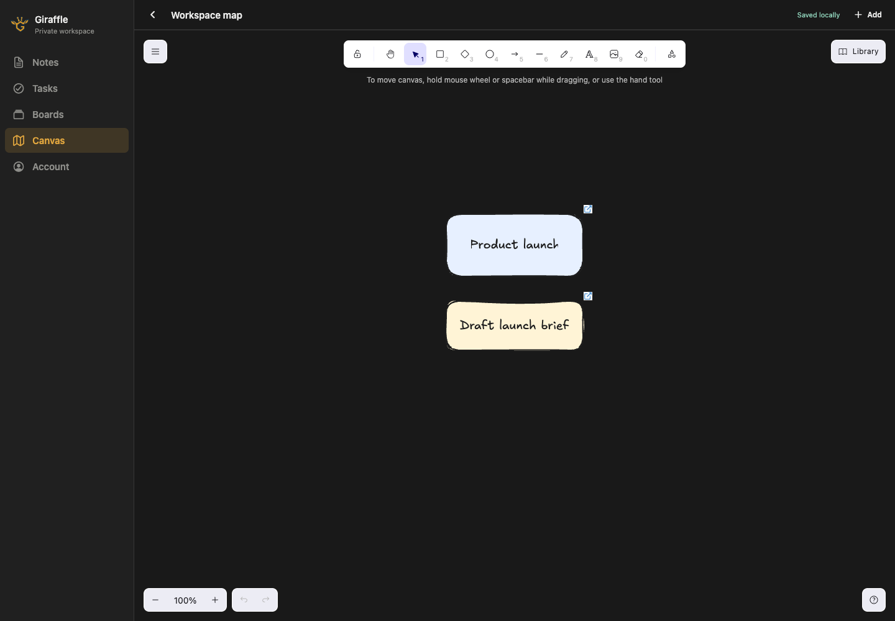

<p align="center">
  
</p>

<h1 align="center">Giraffle</h1>

<p align="center">
  A private, offline-first workspace for notes, tasks, boards and visual planning — built once for iOS, Android and the browser. Your data stays on your device; optional self-hosted sync only relays ciphertext.
</p>

<p align="center">
  
  
  
  
  
</p>

<p align="center">
  <a href="#why-giraffle">Why Giraffle</a> •
  <a href="#screenshots">Screenshots</a> •
  <a href="#features">Features</a> •
  <a href="#running-the-client">Running the Client</a> •
  <a href="#building-the-client">Building</a> •
  <a href="#hosting-the-sync-relay">Hosting the Relay</a> •
  <a href="#pairing-a-second-device">Pairing</a> •
  <a href="#repository-layout">Layout</a>
</p>

## Screenshots

<p align="center">
  
</p>
<p align="center">
  
  
</p>

<p align="center"><sub>Priority, Boards and Canvas from the current Expo Universal client.</sub></p>

## Why Giraffle

Giraffle is one app — an Expo Universal client that runs as a native iOS app, a native Android app, and a web app from the same source — plus an optional relay you can run to move changes between your own devices.

Three rules shape every decision:

- **The device owns the data.** Every page, task, board and canvas is written to an encrypted SQLite database on the device. Every read and write works with the network off. There is no "loading" state waiting on a server.
- **The relay is blind.** Content is encrypted on the device with keys the device never sends anywhere. The relay stores opaque blobs and the metadata it needs to order them. Whoever runs it — including you — cannot read a note.
- **There is no account.** No sign-up, no email, no password, no server-side user record. A vault is identified by an id and an access token you generate yourself; a second device joins by being authorized by the first.

### The privacy model in plain terms

Your notes are encrypted before they leave the app. The relay receives ciphertext, stores ciphertext, and hands ciphertext back to devices that hold the right token. It has no key, so a stolen database, a subpoena, or a curious operator yields nothing readable.

What the relay *does* see: how many records exist, roughly how big they are, when they were pushed, and which device pushed them. That is the cost of having a sync service at all. If you never turn sync on, it sees nothing, because you never run it.

## Features

- **Notes:** Tiptap block editing, images, wikilinks, backlinks, nested pages and Markdown export
- **Quick capture:** create an unscheduled, boardless and unprioritized task directly into Inbox
- **Calendar:** day, week and month planning with drag, resize and range creation
- **Priority:** Focus, Plan, Delegate and Drop as optional views over canonical tasks
- **Boards:** Kanban workflow placement without copying a task or changing its source page
- **Canvas:** Excalidraw shapes plus searchable live references to pages, boards and tasks
- **Local first:** encrypted SQLite, device-held keys, offline reads/writes and a password or quick-PIN lock
- **Optional sync:** ciphertext-only exchange between devices through a self-hosted blind relay

### Current product model

| Entity / view | Owns | Does not duplicate |
| --- | --- | --- |
| **Page** | A task's permanent context and source | Board position, date or priority |
| **Board** | Optional board, column and ordering | Task text, completion, date or priority |
| **Calendar** | Optional due date, start time and duration | Task content or board state |
| **Priority** | Optional Focus / Plan / Delegate / Drop placement | Page or board data |
| **Canvas** | Excalidraw scene and canonical entity references | Copies of pages, boards or tasks |

A task is one canonical `taskItem` block. Quick tasks start in the visible **Inbox** page with no board, date or priority. Every view edits only its own optional dimension. A board is itself a specialized page, while Canvas links to canonical IDs instead of cloning content.

## Running the Client

### Prerequisites

- Node.js 22 (the relay image and current development setup use Node 22)
- Xcode (for iOS) or Android Studio (for Android). Neither is needed for the web target.

### Setup

```bash
cd apps/app
npm install
cp .env.example .env      # optional; leave EXPO_PUBLIC_SYNC_BASE_URL blank to stay fully offline
```

### Run

```bash
npm run ios          # native iOS, builds a dev client
npm run android      # native Android
npm run web          # browser
npm start            # dev server for an already-installed dev client
```

The client needs native modules (encrypted SQLite, libsodium, secure storage), so `npm run ios` / `npm run android` build a development client rather than running in Expo Go.

### Checks

```bash
cd apps/app
npm run verify       # lint + typecheck + tests + export
```

From the repository root, `npm run verify` covers the shared packages instead — typecheck plus the `packages/*/tests` suites that pin the crypto, sync and domain behavior the client is built on.

## Building the Client

```bash
cd apps/app
npm run export       # native JS bundles for iOS and Android
npm run export:web   # static web build
npm run prebuild     # regenerate the native ios/ and android/ projects
```

Store builds go through EAS; see `apps/app/eas.json` for the profiles.

## Hosting the Sync Relay

The relay is a single small container. It needs no database server, no reverse proxy to function, and no configuration beyond one token.

### Quick start

```bash
cp .env.example .env
$EDITOR .env                                    # set SYNC_TOKENS
docker compose up -d --build
curl http://localhost:8787/health/ready         # {"status":"ready"}
```

`docker-compose.yml` runs one service, built from `apps/server/Dockerfile` with the repository root as the build context. Its SQLite database lives on the named volume `giraffle_sync_data`, mounted at `/data`.

### Configuration

| Variable | Required | Meaning |
| --- | --- | --- |
| `SYNC_TOKENS` | yes | Comma-separated `vaultId:token` pairs. Generate a token with `openssl rand -base64 48`. |
| `SYNC_PORT` | no | Host port to publish on. Default `8787`. |
| `HOST` | no | Interface to bind when running outside Docker. Default `0.0.0.0`. |
| `PORT` | no | Port to listen on. Default `8787`. |
| `DATABASE_PATH` | no | SQLite file. Default `./data/giraffle-sync.db`; `/data/giraffle-sync.db` in the container. |

`SYNC_TOKENS` is the operator credential and the whole access-control system. The relay **replaces its token table from this variable on every boot**, so removing a pair revokes it at the next restart. Only the SHA-256 digest of each token is stored.

### Endpoints

| Route | Purpose |
| --- | --- |
| `GET /health/live` | Process is up. Never touches the database. |
| `GET /health/ready` | Database is answering. |
| `POST /api/v1/vaults/:vaultId/devices` | Register a device. |
| `GET /api/v1/vaults/:vaultId/devices` | List registered devices. |
| `POST /api/v1/vaults/:vaultId/devices/:deviceId/authorization` | Authorize a pending device. |
| `GET /api/v1/vaults/:vaultId/devices/:deviceId/grant` | Fetch the wrapped key grant for a device. |
| `POST /api/v1/vaults/:vaultId/sync/push` | Upload encrypted records. |
| `GET /api/v1/vaults/:vaultId/sync/pull` | Download encrypted records. |

Everything under `/api/v1/vaults` requires the vault's bearer token. Put the relay behind TLS before exposing it to the internet — a terminating proxy or a tunnel, whichever you already run.

### Running without Docker

```bash
npm --prefix apps/server install
SYNC_TOKENS=my-vault:$(openssl rand -base64 48) npm --prefix apps/server run dev
```

## Pairing a Second Device

1. **Point both devices at the relay.** Set `EXPO_PUBLIC_SYNC_BASE_URL` to the relay URL. In the join screen, enter the same vault id and the matching `SYNC_TOKENS` value as the connection code.
2. **The first device claims the vault.** It generates the vault key, wraps it with its own device key, and pushes encrypted records.
3. **The new device asks to join.** Open the join screen; it registers itself and waits, unauthorized. The relay will not hand it any key material yet.
4. **The first device approves it.** Approving signs the new device into the vault's device chain and uploads the vault key wrapped for that device alone. The relay relays that blob without being able to open it.
5. **The new device pulls.** It unwraps the key with its own device key and decrypts the history locally.

Only a device that already holds the vault key can admit another one. The relay's token proves *which vault* you are talking to; it does not, on its own, let anyone read that vault.

## Repository Layout

```text
apps/
  app/            Expo Universal client — iOS, Android, web
  server/         blind sync relay (Hono + SQLite), with its own Dockerfile
packages/
  domain/         pages, tasks, boards, links, ordering, Markdown, MCP tool catalog
  protocol/       canonical CBOR, crypto provider, device chain, HLC, sync records
  sync/           key wrapping, checkpoints, Yjs and Excalidraw merge, blob crypto
tests/vectors/    frozen protocol test vectors, shared by the client and the packages
public/           logo and screenshots used by this README
docker-compose.yml  runs the relay
```

The client and the relay each install and test themselves; the root workspace owns only `packages/*`.

## Agent Control

`packages/domain/src/mcp/` holds the catalog of tools an agent can call against a workspace — 42 tools covering pages, search, scheduling, priority, canvases and boards, with their names, descriptions and argument schemas. It is a contract, not a server: the relay is blind and cannot answer any of these calls, so an MCP host has to run inside a client that already holds the vault key. That host does not exist yet.

## Releasing

`package.json` version must match the git tag, always in `vMAJOR.MINOR.PATCH` form.

```bash
npm run verify
npm --prefix apps/app run verify
npm --prefix apps/server run test
```
