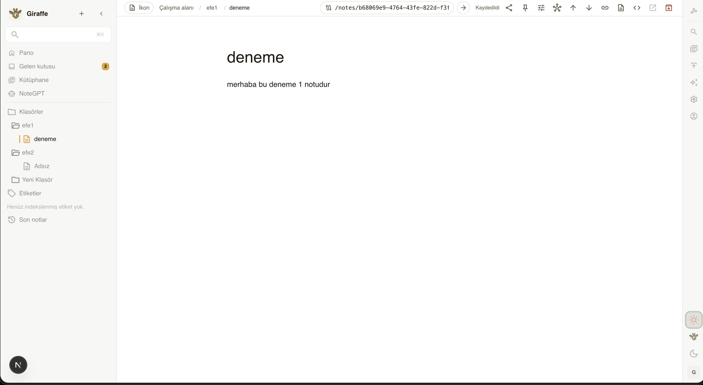

<p align="center">
  
</p>

<h1 align="center">Giraffle</h1>

<p align="center">
  A self-hosted knowledge editor that combines block editing, wikilinks, backlinks, graph navigation, and canonical PostgreSQL storage.
</p>

<p align="center">
  
  
  
  
  
  
</p>

<p align="center">
  <a href="#why-giraffle">Why Giraffle</a> •
  <a href="#ui-screenshots">UI Screenshots</a> •
  <a href="#features">Features</a> •
  <a href="#local-development">Local Development</a> •
  <a href="#production-deployment">Production Deployment</a> •
  <a href="#project-structure">Project Structure</a>
</p>

## UI Screenshots

<p align="center">
  
  
  
</p>

## Why Giraffle

Giraffle is built for people who want a Notion-like editing experience, Obsidian-style linking, and a deployment model they can fully own.

Instead of storing notes as loose markdown files first and reconstructing structure later, Giraffle keeps a canonical block AST in PostgreSQL, then derives Markdown and MDX as export formats. That gives you a richer editor model without giving up portability.

## Features

- Block-based editing with Tiptap and custom block behaviors
- Wikilinks, backlinks, unresolved links, and graph projection
- PostgreSQL-backed canonical note and block storage
- Folder hierarchy, publishing, and note organization tools
- Markdown and MDX export from canonical note data
- Public note routes and slug-based published pages
- Self-hosted production stack with Docker Compose, PostgreSQL, and nginx
- In-app update center that checks GitHub Releases and shows the recommended upgrade command

## Current Foundation

- Tiptap editor with custom `callout`, `toggle`, `wikilink`, `image`, and slash-command support
- Canonical AST persistence into `Note` and `Block` tables
- Patch-aware note saves plus explicit block mutation service APIs
- Persisted wikilink index, backlinks, unresolved links, and graph projection
- Folder navigation, note move flow, publish toggle, Markdown/MDX export, and public note pages

## Stack

| Layer | Technology |
| --- | --- |
| Framework | Next.js App Router |
| UI | React 19 + Tiptap |
| Database | PostgreSQL 16 |
| ORM / Client | Prisma 7 + `@prisma/adapter-pg` |
| Auth | NextAuth |
| Deployment | Docker Compose + nginx |

## Core Domains

| Domain | Responsibility |
| --- | --- |
| Note | metadata, canonical document, publish state |
| Block | stable block IDs, ordering, parent-child nesting |
| Link | wikilinks, resolved note targets, backlinks, graph edges |
| Folder | hierarchical organization and publish path segments |

## Local Development

### Prerequisites

- Node.js 20+
- Docker

### Setup

```bash
npm install
docker compose up -d
cp .env.example .env
npx prisma migrate dev
npm run dev
```

Set `AUTH_SECRET` in `.env` to a long random value before logging in.

### Verification

```bash
npm run test:run
npm run verify
```

For coverage reports:

```bash
npm run test:coverage
```

For a production-like smoke test that builds the Docker image, starts PostgreSQL, applies migrations, and checks `/api/health/ready`:

```bash
ENV_FILE=.env.production npm run smoke:prod
```

### Local Services

- App: `http://localhost:3000`
- PostgreSQL: `localhost:5432`

## Main Routes

- `/dashboard` workspace overview
- `/notes/[noteId]` editable note view
- `/folders/[folderId]` folder-scoped note listing
- `/graph` link graph over persisted projections
- `/inbox` default landing area for notes without folders
- `/search` filterable workspace search
- `/publish` publish/export workspace
- `/settings` theme, sidebar, and local sync preferences
- `/account` account and password maintenance
- `/p/[noteId]` public published note surface
- `/published/[...slugParts]` slug-based public published route

## Export And Publish

- Notes stay canonical in block AST form.
- Markdown and MDX are derived through `src/domain/note/note.serializer.ts` and `src/domain/note/note.export.ts`.
- Publish file paths are derived from folder lineage plus slugified note titles.

## CI/CD

GitHub Actions now runs a clean release pipeline:

- `quality`: install, Prisma validation, lint, typecheck, unit/integration tests, production build, security audit
- `smoke`: build the production image and boot the real Docker Compose stack until `/api/health/ready` responds
- `publish`: push multi-arch Docker images to Docker Hub only after the quality and smoke gates pass
- `release`: when a `v*` tag is pushed, create a GitHub Release automatically

### Release standard

- `main` publishes rolling Docker tags such as `latest` and `sha-<shortsha>`
- `vMAJOR.MINOR.PATCH` tags create immutable release builds such as `v0.1.1`
- the in-app update center follows **GitHub Releases**, not raw commits on `main`
- `package.json` version must match the git tag

Example:

- `package.json`: `0.1.1`
- git tag: `v0.1.1`

For the maintainer release flow, see [`docs/releasing.md`](./docs/releasing.md).

### Maintainer release quickstart

```bash
# 1) ensure everything is green
npm run verify

# 2) push main
git push origin main

# 3) cut the release tag (must match package.json version)
git tag v0.1.0
git push origin v0.1.0
```

> Tag format is always `vMAJOR.MINOR.PATCH` and must match `package.json`.

## Production Deployment

For a simpler step-by-step server guide, see [`docs/deploy.md`](./docs/deploy.md). For image-first platforms such as Coolify, Dokploy, CasaOS, and Portainer, see [`docs/self-hosting.md`](./docs/self-hosting.md).

Giraffle ships with a production Docker Compose stack that runs:

- `postgres` for durable application storage
- `app` for the standalone Next.js server
- optional `nginx` via a separate proxy compose file

### Quick Start

```bash
cp .env.production.example .env.production
$EDITOR .env.production
./scripts/prod-up.sh
```

If you prefer an image-first deployment without cloning the whole repo on the target machine, use:

- `deploy/selfhost/docker-compose.image.yml`
- `deploy/selfhost/.env.image.example`

These are intended for self-hosted control planes such as Coolify, Dokploy, CasaOS, and Portainer.

Set `APP_IMAGE` to the published Docker Hub image, for example `docker.io/efekurucay/giraffle:latest`.

End users do not need to build or publish the image themselves.

Then open `http://localhost:3000` for a production smoke test, or point your domain at the server and set `NEXTAUTH_URL` accordingly.

### What The Production Stack Does

- pulls the app image from Docker Hub via `APP_IMAGE`
- runs `prisma migrate deploy` on startup
- publishes the app directly on `APP_PORT` (default `3000`)
- exposes `/api/health/live` and `/api/health/ready` for liveness and readiness checks
- persists PostgreSQL data in `giraffle_pgdata`
- persists uploaded images in `giraffle_uploads`
- keeps `prisma.config.ts` inside the image because Prisma 7 reads datasource config from it during `migrate deploy`

### Required Environment Variables

- `APP_IMAGE`
- `DATABASE_URL`
- `AUTH_SECRET`
- `NEXTAUTH_URL`
- `LOG_LEVEL`
- `APP_PORT`
- optional: `APP_ENCRYPTION_KEY` to encrypt app-managed settings stored from inside the UI
- optional: `DEPLOYMENT_ID` for version-skew protection during rolling deploys
- `POSTGRES_USER`
- `POSTGRES_PASSWORD`
- `POSTGRES_DB`

### Server Steps

```bash
git clone <your-repo-url> giraffle
cd giraffle
cp .env.production.example .env.production
$EDITOR .env.production
./scripts/prod-up.sh
```

### Useful Commands

```bash
./scripts/prod-logs.sh
docker compose --env-file .env.production -f docker-compose.prod.yml ps
docker compose --env-file .env.production -f docker-compose.prod.yml restart app
docker compose --env-file .env.production -f docker-compose.prod.yml down
```

### In-app update notifications

Giraffle checks the latest GitHub Release and shows an update notice inside the dashboard and settings screens.

If you maintain a fork and want update checks to point to your own release feed, set:

```env
APP_UPDATE_REPOSITORY=your-org/your-fork
```

Recommended upgrade command:

```bash
cd giraffle
git pull
./scripts/prod-up.sh
```

### Maintainer Note

Image publishing is a maintainer-only workflow. End users should deploy the already published image from Docker Hub using `APP_IMAGE` and `./scripts/prod-up.sh`.

`NEXTAUTH_URL` must match the public URL you actually use, for example `http://203.0.113.10` or `https://notes.example.com`.

### Optional Reverse Proxy

If you want a front proxy like many self-hosted setups use:

```bash
./scripts/prod-up-proxy.sh
```

That adds nginx on port `80` in front of the app. The default stack intentionally stays simpler and publishes the app directly on `APP_PORT`, which matches the default self-host pattern used by projects like AFFiNE, SiYuan, and Memos.

### Runtime Notes

- The production app container intentionally keeps the full runtime `node_modules` tree. Prisma 7 CLI dependencies are needed for in-container `prisma migrate deploy`.
- Uploads are written to `/app/public/uploads` and persisted through the `giraffle_uploads` Docker volume.
- By default the app is public on `APP_PORT` and reachable directly, usually `http://localhost:3000`.
- nginx is optional and only starts when `docker-compose.proxy.yml` is included.
- Optional external integrations can use the authenticated MCP endpoint. Giraffle contains no built-in AI runtime. See [docs/mcp.md](docs/mcp.md).

## Auth Baseline

- credential login with bcrypt password hashes
- production secret requirement
- secure cookies in production
- basic login and registration rate limiting

## Project Structure

```text
src/
  app/
  components/
    editor/
    graph/
    notes/
    sidebar/
  domain/
    folder/
    link/
    note/
  lib/
  server/
```
