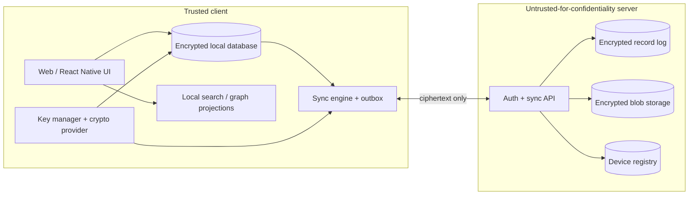

# Giraffle E2EE Local-First Architecture

Status: **Accepted foundation**
Scope: web client, future React Native client, self-hosted sync server
Owner model: one user, multiple trusted devices

## Decision

Giraffle will evolve from a server-centric CRUD application into a local-first encrypted vault. Clients own plaintext and authoritative materialized state. The server authenticates devices and stores opaque encrypted records, checkpoints, and blobs.

This is not a Signal/WhatsApp protocol implementation. Messaging ratchets and MLS optimize ephemeral conversation streams and group membership. Giraffle needs durable, mutable, replayable documents, so it uses envelope encryption plus an encrypted append-only replication log.

## Required properties

1. Notes remain fully usable without a network connection.
2. Local writes commit before network synchronization.
3. The server never receives vault keys or private note plaintext.
4. Replayed, duplicated, reordered, truncated, or corrupt sync records are detectable.
5. Multi-device convergence does not silently overwrite note-body edits.
6. Password changes do not require re-encrypting all vault data.
7. Device enrollment requires an existing trusted device or recovery secret.
8. Lost-device revocation protects future writes; it cannot erase keys already extracted by that device.
9. Search, backlinks, graph, tasks, and kanban projections run on unlocked clients.
10. Publishing and AI access are explicit plaintext disclosure boundaries.

## High-level topology

## Trust boundaries

- **Trusted:** unlocked signed clients, their local crypto provider, their local materialized database.
- **Not trusted for confidentiality:** Next.js server, PostgreSQL, object storage, backups, reverse proxy, push provider.
- **Still trusted for availability:** the self-hosted server can withhold or delete data. E2EE does not solve denial of service.
- **Special case — web:** a compromised server can serve malicious JavaScript that steals an unlock secret. Web E2EE protects stored data from passive compromise, but a signed mobile client provides a stronger execution trust boundary.

## Target runtime

### Client

- Local SQLCipher database on React Native.
- Ciphertext IndexedDB/OPFS cache on web; vault keys remain client-side.
- Atomic materialized-state + outbox writes.
- Local search and derived indexes.
- Bundled/offline editor surfaces for Tiptap and Excalidraw.

### Server

- Device authentication and revocation.
- Append-only encrypted record ingestion.
- Monotonic server cursor assignment.
- Encrypted checkpoint and attachment storage.
- Data-free push notifications used only as wake-up hints.
- No note, block, search, graph, task, or canvas semantics.

## Architecture records

1. [Threat model](./001-threat-model.md)
2. [Cryptography and key hierarchy](./002-cryptography-and-keys.md)
3. [Encrypted synchronization protocol](./003-sync-protocol.md)
4. [Conflict and document model](./004-conflict-model.md)
5. [Device lifecycle and recovery](./005-device-lifecycle.md)
6. [Client storage, migration, and verification](./006-client-migration-verification.md)

## Product consequences

- Existing server-side `searchText`, `Link`, todo queries, and graph projections cannot remain authoritative under full E2EE.
- Existing `OperationLog` is a plaintext audit trail, not a replication protocol, and will not be reused as the encrypted sync log.
- Server-side MCP cannot transparently inspect encrypted notes. It must become client-mediated or require an explicit disclosure of selected plaintext before E2EE cutover.
- Publishing creates a separate sanitized plaintext projection; private records remain encrypted.

## Implementation status

Completed experimental gates (not connected to durable user data):

- web/Node libsodium provider
- XChaCha20-Poly1305, Argon2id, Ed25519, hash, and keyed-hash vectors
- RFC 8949 deterministic CBOR with strict subset validation
- canonical encrypted/signed sync-record vector
- AAD, signature, object-locator, and hash-chain validation
- HLC monotonicity and deterministic LWW ordering
- recipient-bound sealed VRK wrapper with signed device authorization
- Argon2id/XChaCha20-Poly1305 passphrase wrapper with bounded KDF parameters
- versioned 256-bit recovery code with Crockford Base32 and a 40-bit checksum
- recovery-secret-derived XChaCha20-Poly1305 VRK wrapper
- VRK-wrapped content-key epochs and future-record revocation boundary
- signed encrypted full-state checkpoints with per-device frontiers
- signed checkpoint acknowledgements and multi-gate compaction policy
- deterministic LWW presence/metadata registers and folder-cycle repair
- per-blob DEKs, authenticated chunks, and encrypted completeness manifests
- Yjs update merge/state-vector/checkpoint convergence with thousands of offline edits
- Excalidraw version/versionNonce merge, tombstones, and conflict-copy detection
- model-level crash injection across local-write and remote-cursor transaction boundaries
- atomic encrypted IndexedDB record/outbox/cursor/device-head storage
- duplicate, collision, sequence-gap, tamper, reorder, and two-device convergence simulation

Pending before any production cutover:

- React Native provider passing the same vectors
- durable local transaction/outbox implementation
- browser runtime E2E and mobile SQLCipher storage-adapter crash tests
- external security review

## Open implementation choices

These require prototypes before locking a library:

- React Native validation of the selected libsodium provider against the checked-in vectors.
- Yjs persistence bridge inside a bundled mobile Tiptap WebView.
- Web offline store: encrypted IndexedDB records versus SQLite-WASM/OPFS.
- Excalidraw element-level merge implementation.

The protocol is crypto-agile: every envelope carries a protocol version, suite identifier, key epoch, and schema version.

## Primary references

- [Local-first software — Ink & Switch](https://www.inkandswitch.com/essay/local-first/)
- [RFC 9106 — Argon2](https://www.rfc-editor.org/rfc/rfc9106.html)
- [RFC 9180 — HPKE](https://www.rfc-editor.org/rfc/rfc9180.html)
- [Libsodium XChaCha20-Poly1305](https://doc.libsodium.org/secret-key_cryptography/aead/chacha20-poly1305/xchacha20-poly1305_construction)
- [Yjs document updates](https://docs.yjs.dev/api/document-updates)
- [Tiptap Collaboration](https://tiptap.dev/docs/editor/extensions/functionality/collaboration)
- [Expo SQLite / SQLCipher](https://docs.expo.dev/versions/latest/sdk/sqlite/)
- [Expo SecureStore](https://docs.expo.dev/versions/latest/sdk/securestore/)
- [Standard Notes encryption whitepaper](https://standardnotes.com/help/security/encryption)
- [Joplin E2EE specification](https://joplinapp.org/help/dev/spec/e2ee/)
